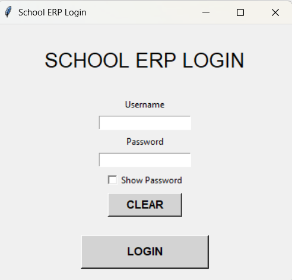
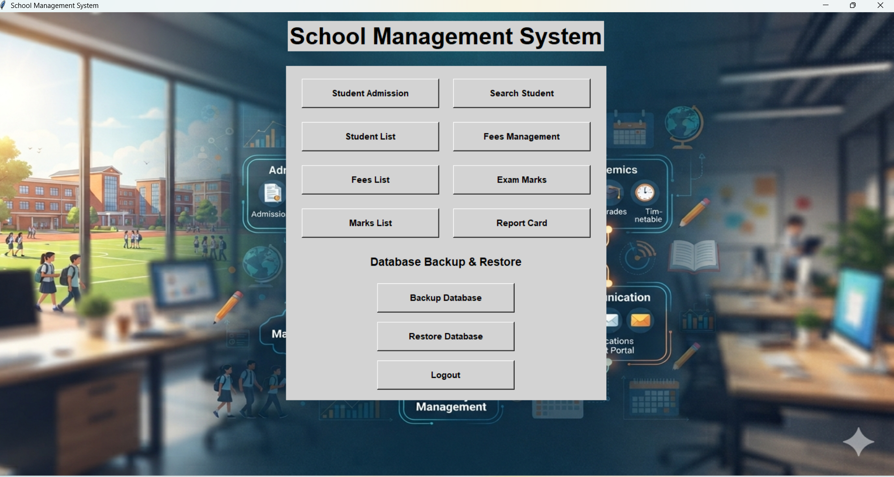
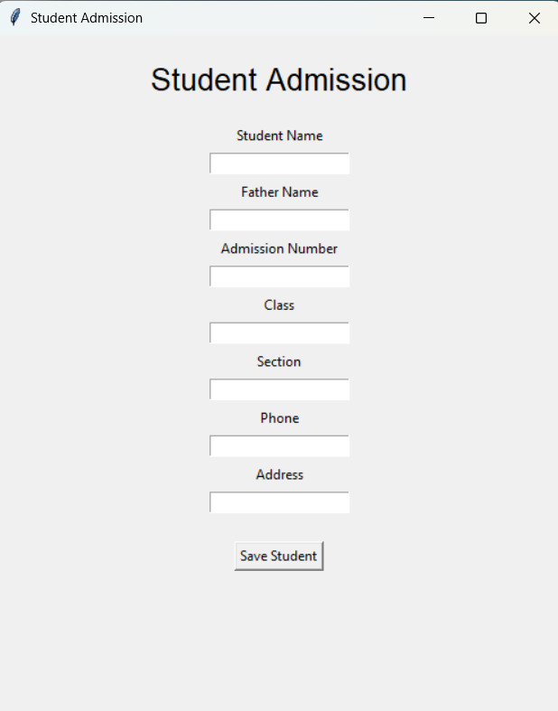
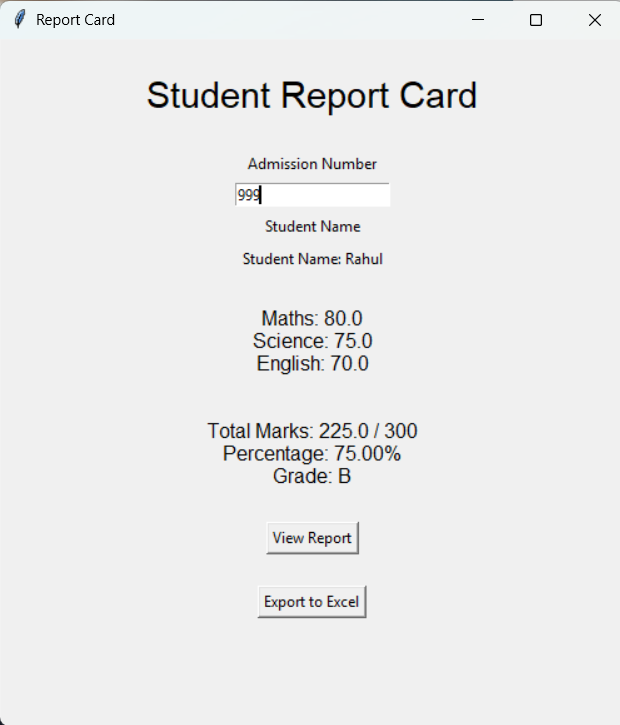

# Offline School ERP System

A desktop-based offline school management system developed using Python, Tkinter, SQLite, and OpenPyXL.

## Project Overview

Offline School ERP is a Windows desktop application designed to manage basic school operations without requiring an internet connection.

The system provides modules for student admission, student search, fee management, exam marks, report cards, Excel export, database backup and restore, and user login.

## Technologies Used

* Python 3
* Tkinter
* SQLite3
* OpenPyXL
* Pillow
* PyInstaller

## Main Features
## Screenshots

### Login Screen


### Dashboard


### Student Admission


### Fees Management


### Student List


### Report Card


### 1. Student Admission

* Add new student
* Admission number
* Student name
* Father's name
* Class and section
* Phone number
* Address
* Duplicate admission number checking

### 2. Search Student

* Search students using admission number
* Display student details

### 3. Student List

* View registered students
* Display student information

### 4. Fees Management

* Add tuition fee
* Add bus fee
* Calculate total fee
* View fee records

### 5. Exam Marks

* Enter Maths marks
* Enter Science marks
* Enter English marks
* View marks records

### 6. Report Card

* Calculate total marks
* Calculate percentage
* Generate grade
* Export report card to Excel

### 7. Database Backup and Restore

* Create database backup
* Restore database from backup
* Helps protect school data

### 8. Login System

* Username and password authentication
* Show/Hide password
* Logout functionality

## Report Card Calculation

The system calculates:

**Total Marks**

Maths + Science + English

**Percentage**

Total Marks / 300 × 100

### Grade System

| Percentage    | Grade |
| ------------- | ----- |
| 90% and above | A+    |
| 80% - 89%     | A     |
| 70% - 79%     | B     |
| 60% - 69%     | C     |
| 50% - 59%     | D     |
| Below 50%     | F     |

## Project Structure

```text
Offline-School-ERP/
│
├── assets/
│   └── school_bg.jpg
│
├── admission.py
├── search_student.py
├── student_list.py
├── fees.py
├── fees_list.py
├── marks.py
├── marks_list.py
├── report.py
├── login.py
├── main.py
├── database.py
├── db_path.py
├── migrate_database.py
├── check_data.py
├── check_student.py
├── .gitignore
└── README.md
```

## Database

The application uses SQLite as its database.

The database stores:

* Student information
* Fee records
* Exam marks
* User login information

The live database is stored in the user's `SchoolERP` folder so that the application can write data when installed as a Windows executable.

## Running the Project

Install the required Python packages:

```bash
pip install openpyxl pillow
```

Then run:

```bash
python login.py
```

Default login:

`The application provides a login system for authorized users.
```

## Windows EXE

The project can be packaged as a Windows executable using PyInstaller.

The application is designed to work as an offline desktop application and does not require an internet connection for normal school management operations.

## Future Improvements

Possible future improvements include:

* Student photo management
* Attendance management
* More subjects
* Fee payment history
* User management
* Improved password security
* Printable report cards

## Author

**Devesh Tiwari**

Computer Science Graduate

GitHub: `deveshtiwari9794`
